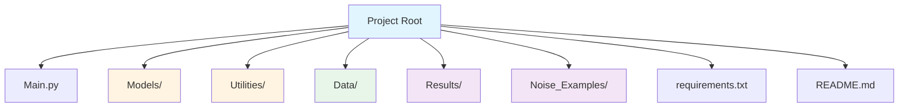
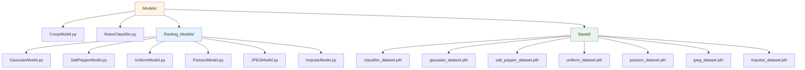
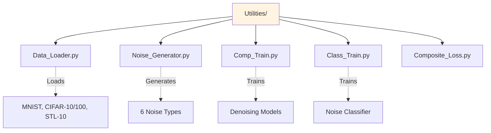
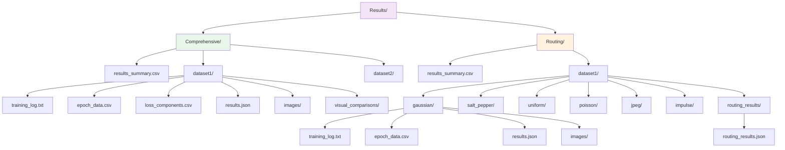
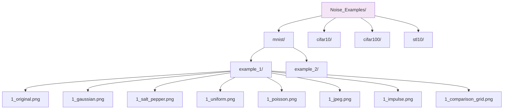

# Adaptive Noise-Type Routing for CNN Denoising

## Project Structure

```
.
├── Main.py                     # Main entry point for training
├── Train.py                    # Training loop and evaluation logic
├── Data_Loader.py              # Dataset loading utilities (MNIST, CIFAR-10/100, STL-10)
├── Noise_Generator.py          # Noise generation for all supported types
├── CompositeLoss.py            # Custom composite loss function (MSE + MAE + SSIM + Gradient)
│
├── Models/
│   ├── CompModel.py            # Model architecture definitions
│   └── ...                     # Additional model variants
│
├── Data/                       # Dataset storage (auto-downloaded)
│
├── Results/                    # Training outputs and metrics
│   ├── results_summary.csv     # Aggregated results across all runs
│   └── {model}_{dataset}/      # Per-experiment results
│       ├── training_log.txt    # Detailed training logs
│       ├── epoch_data.csv      # Per-epoch metrics (loss, PSNR, SSIM)
│       ├── loss_components.csv # Individual loss components per epoch
│       ├── results.json        # Final test results
│       ├── images/             # Sample denoised images
│       │   ├── 1_original.png
│       │   ├── 1_generated.png
│       │   └── ...
│       └── visual_comparisons/ # Side-by-side comparisons
│           ├── comparison_0.png
│           └── ...
│
└── Noise_Examples/             # Example noisy images for visualization
    ├── mnist/
    │   ├── mnist_example_1/
    │   │   ├── 1_original.png
    │   │   ├── 1_gaussian.png
    │   │   ├── 1_salt_pepper.png
    │   │   ├── 1_uniform.png
    │   │   ├── 1_poisson.png
    │   │   ├── 1_jpeg.png
    │   │   ├── 1_impulse.png
    │   │   └── 1_comparison_grid.png
    │   └── mnist_example_2/...
    ├── cifar10/...
    ├── cifar100/...
    └── stl10/...
```

## Overview

This project develops an adaptive CNN-based image denoising system that identifies noise types and routes inputs through specialized denoising branches. The system handles multiple noise types including Gaussian, salt-and-pepper, uniform, Poisson, JPEG compression artifacts, and impulse noise.

## Features

- **Multi-noise support**: Gaussian, salt-and-pepper, uniform, Poisson, JPEG, impulse
- **Multiple datasets**: MNIST, CIFAR-10, CIFAR-100, STL-10
- **Composite loss function**: MSE (35%) + MAE (35%) + SSIM (20%) + Gradient Loss (10%)
- **Comprehensive metrics**: Loss, PSNR, SSIM with component-level tracking
- **Automatic visualization**: Generates comparison images and training curves
- **Early stopping**: Prevents overfitting with configurable patience

## Requirements

```bash
pip install -r requirements.txt
```

## Quick Start

### Basic Training

```bash
# Train on CIFAR-10 (default)
python Main.py
```

### Download Datasets

```bash
# Download all datasets
python Data_Loader.py
```

### Generate Noise Examples

```bash
# Generate examples for all datasets
python Noise_Generator.py --generate_examples --dataset all
```

## Command Line Arguments

| Argument          | Default     | Description                                             |
| ----------------- | ----------- | ------------------------------------------------------- |
| `--model`         | `comp`      | Model type: `comp` or `routing`                         |
| `--dataset`       | `cifar10`   | Dataset: `mnist`, `cifar10`, `cifar100`, `stl10`, `all` |
| `--epochs`        | `50`        | Number of training epochs                               |
| `--learning_rate` | `0.001`     | Learning rate for optimizer                             |
| `--batch_size`    | `0`         | Batch size (0 for auto-adjust based on dataset)         |
| `--ESP`           | `10`        | Early stopping patience (epochs)                        |
| `--output_dir`    | `./Results` | Directory for saving results                            |
| `--data_root`     | `./Data`    | Root directory for datasets                             |
| `--device`        | `cuda/cpu`  | Device for training (auto-detected)                     |
| `--num_workers`   | `4`         | Number of data loading workers                          |
| `--seed`          | `42`        | Random seed for reproducibility                         |

## Loss Function

The composite loss function combines four components:

- **MSE Loss (35%)**: Pixel-wise reconstruction accuracy
- **MAE Loss (35%)**: Robustness to outliers and noise
- **SSIM Loss (20%)**: Structural similarity preservation
- **Gradient Loss (10%)**: Edge and detail preservation using Sobel filters

Individual loss components are tracked and saved in `loss_components.csv`.

## Supported Noise Types

1. **Gaussian**: Additive white Gaussian noise (σ = 25)
2. **Salt-and-Pepper**: Random white/black pixels (10% ratio)
3. **Uniform**: Uniform random noise (±25 range)
4. **Poisson**: Shot noise simulation (λ = 30)
5. **JPEG**: Compression artifacts (quality = 30)
6. **Impulse**: Random-valued impulse noise (10% ratio)

## Output Files

### Per-Experiment Results

- `training_log.txt`: Detailed epoch-by-epoch training logs
- `epoch_data.csv`: Metrics per epoch (loss, PSNR, SSIM)
- `loss_components.csv`: Individual loss components (MSE, MAE, SSIM, Gradient)
- `results.json`: Final test results and metadata
- `images/`: Sample original and denoised images
- `visual_comparisons/`: Side-by-side comparison figures

### Aggregated Results

- `results_summary.csv`: All experiments with test metrics and computation time

## Evaluation Metrics

- **Loss**: Composite loss value (weighted combination)
- **PSNR**: Peak Signal-to-Noise Ratio (dB)
- **SSIM**: Structural Similarity Index [0-1]

## Team

- Zachary De Aguiar
- Alexander Green
- William Moulton
- Zachary Wood

## Project Timeline

- **Phase 1** (Sep 12 – Oct 1): Setup and prototype
- **Phase 2** (Oct 2 – Nov 6): Build adaptive model and experiments
- **Phase 3** (Nov 7 – Dec 2): Analysis, report, and presentation

## References

For implementation details and methodology, refer to the project documentation and technical report.


# Adaptive Noise-Type Routing for CNN Denoising

## Project Structure

### Main Directory


### Models Directory


### Utilities Directory


### Results Directory


### Noise Examples Directory


## Overview

This project develops an adaptive CNN-based image denoising system that identifies noise types and routes inputs through specialized denoising branches. The system supports two modes:

1. **Comprehensive Model**: Single unified denoiser trained on all noise types
2. **Routing Model**: Classifier-based system that routes images to noise-specific denoisers

## Features

- **Two training modes**: Comprehensive (unified) and Routing (adaptive)
- **Multi-noise support**: Gaussian, salt-and-pepper, uniform, Poisson, JPEG, impulse
- **Multiple datasets**: MNIST, CIFAR-10, CIFAR-100, STL-10
- **Composite loss function**: MSE (35%) + MAE (35%) + SSIM (20%) + Gradient Loss (10%)
- **Comprehensive metrics**: Loss, PSNR, SSIM with component-level tracking
- **Automatic visualization**: Generates comparison images and training curves
- **Early stopping**: Prevents overfitting with configurable patience
- **Automatic model management**: Checks for existing models and trains missing components

## Requirements

```bash
pip install torch torchvision numpy pillow matplotlib seaborn scikit-learn
```

## Quick Start

### Training Modes

**Comprehensive Model** (Single unified denoiser):
```bash
# Train on single dataset
python Main.py --model comp --dataset cifar10

# Train on all datasets
python Main.py --model comp --dataset all --epochs 50
```

**Routing Model** (Adaptive noise-specific routing):
```bash
# Train classifier + noise-specific models, then evaluate routing
python Main.py --model routing --dataset cifar10

# Automatically trains missing components:
# 1. Noise classifier (if not exists)
# 2. Six noise-specific denoisers (if not exist)
# 3. Evaluates full routing system
```

### Utility Commands

```bash
# Download all datasets
python Utilities/Data_Loader.py

# Generate noise examples for visualization
python Utilities/Noise_Generator.py --generate_examples --dataset all --num_examples 10
```

## Command Line Arguments

| Argument              | Default     | Description                                             |
| --------------------- | ----------- | ------------------------------------------------------- |
| `--model`             | `comp`      | Model type: `comp` or `routing`                         |
| `--dataset`           | `cifar10`   | Dataset: `mnist`, `cifar10`, `cifar100`, `stl10`, `all` |
| `--epochs`            | `50`        | Number of training epochs (denoising models)            |
| `--classifier_epochs` | `30`        | Number of training epochs (noise classifier)            |
| `--learning_rate`     | `0.001`     | Learning rate for optimizer                             |
| `--batch_size`        | `0`         | Batch size (0 for auto-adjust based on dataset)         |
| `--ESP`               | `10`        | Early stopping patience (epochs)                        |
| `--output_dir`        | `./Results` | Directory for saving results                            |
| `--data_root`         | `./Data`    | Root directory for datasets                             |
| `--device`            | `cuda/cpu`  | Device for training (auto-detected)                     |
| `--num_workers`       | `4`         | Number of data loading workers                          |
| `--seed`              | `42`        | Random seed for reproducibility                         |

## Model Architecture

### Comprehensive Model
- **Architecture**: U-Net style encoder-decoder with skip connections
- **Training**: Single model trained on all noise types simultaneously
- **Location**: `Models/CompModel.py`

### Routing System
- **Noise Classifier**: CNN that predicts noise type (6 classes)
  - Location: `Models/NoiseClassifier.py`
  - Saved to: `Models/Saved/classifier_{dataset}.pth`
  
- **Noise-Specific Denoisers**: Six specialized models
  - **Gaussian**: Dilated convolutions for multi-scale context
  - **Salt-and-Pepper**: Spatial attention for sparse corruption
  - **Uniform**: Wider filters with dropout for robustness
  - **Poisson**: Variance stabilization (Anscombe transform)
  - **JPEG**: Deblocking layers for 8×8 artifacts
  - **Impulse**: Non-local attention for context aggregation
  - Location: `Models/Routing_Models/`
  - Saved to: `Models/Saved/{noise_type}_{dataset}.pth`

## Loss Function

The composite loss function combines four components:

- **MSE Loss (35%)**: Pixel-wise reconstruction accuracy
- **MAE Loss (35%)**: Robustness to outliers and noise
- **SSIM Loss (20%)**: Structural similarity preservation
- **Gradient Loss (10%)**: Edge and detail preservation using Sobel filters

Individual loss components are tracked and saved in `loss_components.csv`.

## Supported Noise Types

| Noise Type      | Description                              | Parameters         |
| --------------- | ---------------------------------------- | ------------------ |
| Gaussian        | Additive white Gaussian noise            | σ = 25             |
| Salt-and-Pepper | Random white/black pixels                | ratio = 10%        |
| Uniform         | Uniform random noise                     | range = ±25        |
| Poisson         | Shot noise simulation                    | λ = 30             |
| JPEG            | Compression artifacts                    | quality = 30       |
| Impulse         | Random-valued impulse noise              | ratio = 10%        |

## Output Files

### Comprehensive Model Results
```
Results/Comprehensive/
├── results_summary.csv          # Aggregated results across datasets
└── {dataset}/
    ├── training_log.txt         # Detailed epoch-by-epoch logs
    ├── epoch_data.csv           # Metrics per epoch
    ├── loss_components.csv      # Individual loss components
    ├── results.json             # Final test results
    ├── images/                  # Sample outputs
    │   ├── 1_original.png
    │   └── 1_generated.png
    └── visual_comparisons/      # Side-by-side comparisons
        └── comparison_0.png
```

### Routing Model Results
```
Results/Routing/
├── results_summary.csv          # Not used for routing mode
└── {dataset}/
    ├── {noise_type}/            # Per noise-specific model results
    │   ├── training_log.txt
    │   ├── epoch_data.csv
    │   ├── results.json
    │   ├── images/
    │   └── visual_comparisons/
    └── routing_results/         # Final routing evaluation
        └── routing_results.json
```

### Routing Results Format
```json
{
    "dataset": "cifar10",
    "routing_accuracy": 95.2,
    "avg_psnr": 28.45,
    "avg_ssim": 0.8567,
    "per_noise_metrics": {
        "gaussian": {"psnr": 29.1, "ssim": 0.87, "count": 1000},
        "salt_pepper": {"psnr": 27.8, "ssim": 0.84, "count": 1000},
        ...
    },
    "total_images": 6000
}
```

## Evaluation Metrics

- **Loss**: Composite loss value (weighted combination)
- **PSNR**: Peak Signal-to-Noise Ratio (dB) - higher is better
- **SSIM**: Structural Similarity Index [0-1] - higher is better
- **Routing Accuracy**: Percentage of correct noise type predictions (routing mode only)

## Workflow

### Comprehensive Model
1. Load dataset with random noise generation (all types)
2. Train single unified denoiser
3. Evaluate on test set with all noise types
4. Save model to `Results/Comprehensive/{dataset}/`

### Routing Model
1. **Check dependencies**: Classifier and noise-specific models
2. **Train missing models**:
   - Noise classifier (if needed)
   - Each of 6 noise-specific denoisers (if needed)
3. **Routing evaluation**:
   - Load classifier + all 6 denoisers
   - For each test image:
     - Classify noise type
     - Route to appropriate denoiser
     - Evaluate against ground truth
   - Calculate aggregate and per-noise metrics
4. **Save results** to `Results/Routing/{dataset}/routing_results/`

## Team

- Zachary De Aguiar
- Alexander Green
- William Moulton
- Zachary Wood

## Project Timeline

- **Phase 1** (Sep 12 – Oct 1): Setup and prototype
- **Phase 2** (Oct 2 – Nov 6): Build adaptive model and experiments
- **Phase 3** (Nov 7 – Dec 2): Analysis, report, and presentation

## Citation

If you use this code in your research, please cite:
```
@project{adaptive-noise-routing-2024,
  title={Adaptive Noise-Type Routing for CNN Denoising},
  authors={De Aguiar, Z. and Green, A. and Moulton, W. and Wood, Z.},
  year={2024}
}
```